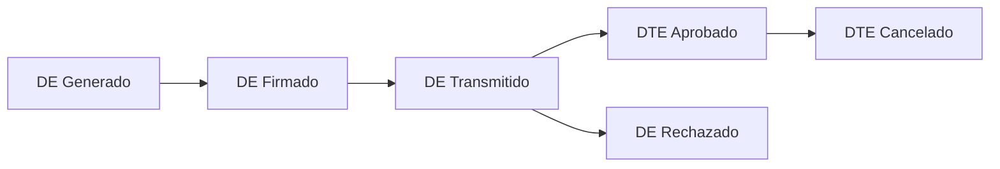
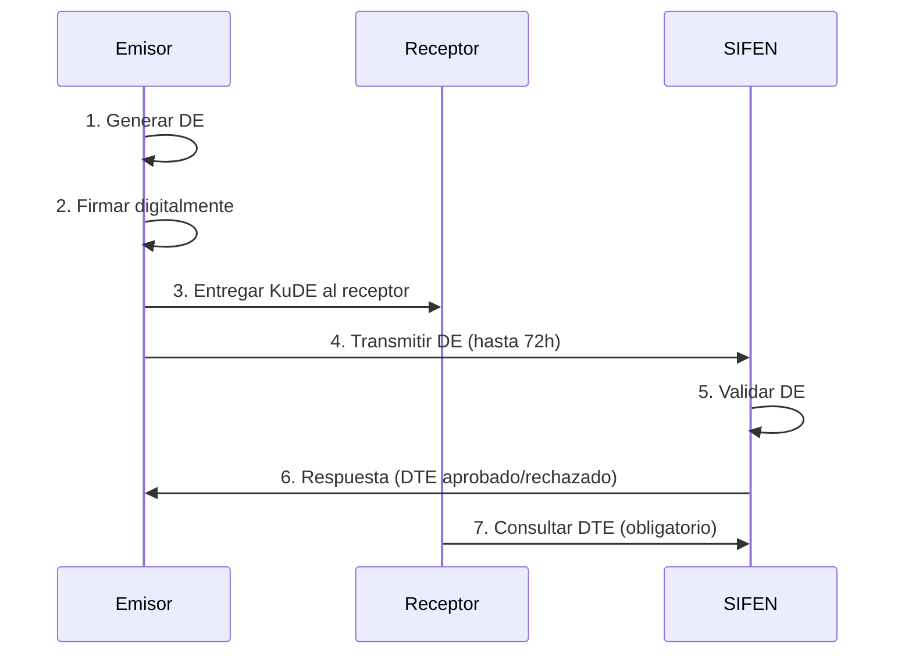
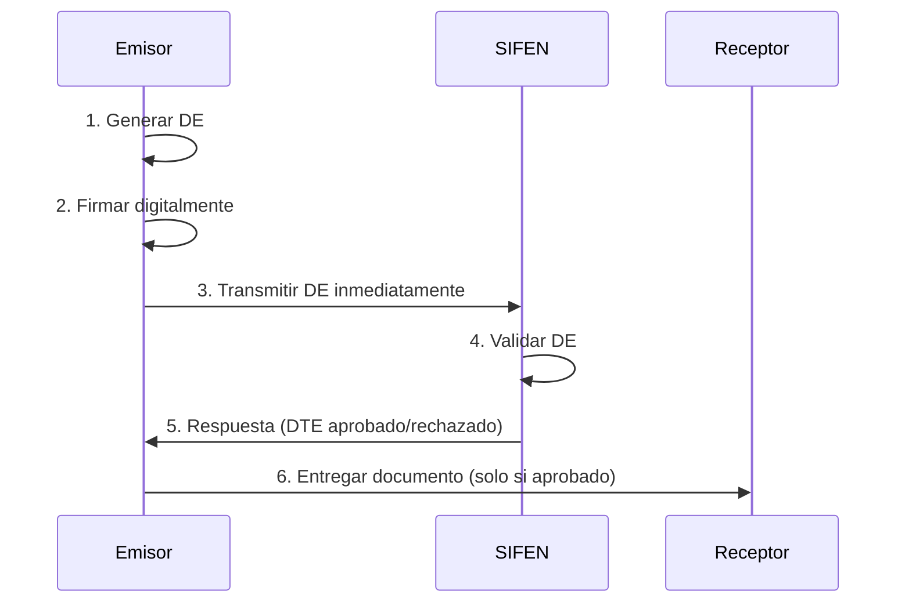

# Modelo Operativo SIFEN v150

## 📋 **Introducción al Modelo Operativo**

El **Sistema Integrado de Facturación Electrónica Nacional (SIFEN)** establece un modelo operativo específico que define cómo los contribuyentes deben interactuar con la SET para la emisión, validación y almacenamiento de documentos tributarios electrónicos.

### **Principios Fundamentales**
- **Validez jurídica**: Documentos electrónicos con firma digital tienen fuerza probatoria (Ley 4.017/2010)
- **Relación directa**: Contribuyentes se relacionan directamente con SET, sin intermediarios obligatorios
- **Flexibilidad operativa**: Permite validación previa o posterior según necesidades del contribuyente
- **Transparencia**: Consulta pública de documentos para verificación

## 🏗️ **Descriptores del Modelo Operativo**

### **1. Archivo Electrónico (DE)**

#### **Definición**
El **Documento Electrónico (DE)** es la representación electrónica en formato XML de una factura u otros documentos tributarios. Tiene naturaleza de **mensaje de datos** y, si contiene firma digital válida, posee **admisibilidad y fuerza probatoria**.

#### **Características**
- **Formato**: XML estructurado según esquemas XSD v150
- **Firma digital**: Obligatoria con certificado PSC
- **Encoding**: UTF-8 únicamente
- **Namespace**: `http://ekuatia.set.gov.py/sifen/xsd`

#### **Estados del DE**


### **2. Aprobación del DTE**

#### **Proceso de Validación**
Para que un DE se convierta en **Documento Tributario Electrónico (DTE)** válido, debe superar tres niveles de validación:

1. **Validaciones de Conexión**
   - Certificado TLS válido
   - Mutual authentication
   - Protocolo SOAP 1.2

2. **Validaciones Técnicas**
   - Estructura XML conforme a XSD
   - Firma digital válida
   - Certificado PSC vigente
   - Encoding UTF-8

3. **Validaciones de Negocio**
   - Campos obligatorios presentes
   - Cálculos correctos (totales, IVA)
   - Códigos válidos (países, unidades, etc.)
   - RUC emisor activo
   - Timbrado vigente

#### **Protocolo de Procesamiento**
```xml
<!-- Schema XML 4: ProtProcesDE_v150.xsd -->
<protProcesDE>
    <dCodRes>0260</dCodRes>                    <!-- Código resultado -->
    <dMsgRes>Autorización del DE satisfactoria</dMsgRes>
    <dFecProc>2019-09-10T14:30:00</dFecProc>   <!-- Fecha procesamiento -->
    <dProtAut>1234567890</dProtAut>            <!-- Número transacción -->
    <Id>01234567890123456789012345678901234567890123</Id> <!-- CDC -->
</protProcesDE>
```

## ⏰ **Plazos SIFEN**

### **Tabla de Plazos Oficiales**

| Situación | Plazo | Observaciones |
|-----------|-------|---------------|
| **Transmisión Normal** | 72 horas | Desde firma digital hasta envío a SIFEN |
| **Transmisión Extemporánea** | 72h - 720h | Aprobado con observaciones + sanción |
| **Rechazo por Extemporaneidad** | > 720 horas (30 días) | Rechazo automático |
| **Trámite Administrativo** | > 720 horas | Normalización manual con SET |
| **Cancelación FE** | 48 horas | Desde aprobación SIFEN |
| **Cancelación otros DE** | 168 horas (7 días) | AFE, NCE, NDE, NRE |
| **Inutilización** | 360 horas (15 días) | Primeros 15 días del mes siguiente |
| **Eventos Receptor** | 1080 horas (45 días) | Desde fecha emisión |
| **Corrección Eventos** | 360 horas (15 días) | Desde primer evento registrado |

### **Detalle de Transmisión Normal**

#### **Condiciones para Transmisión Normal**
Para ser considerada **transmisión normal**, el DE debe cumplir:

1. **Plazo de Firma → Transmisión**: ≤ 72 horas
2. **Plazo de Emisión → Transmisión**: ≤ 120 horas (5 días)

#### **Fórmulas de Validación**
```python
def validar_transmision_normal(fecha_emision, fecha_firma, fecha_transmision):
    """Validar si la transmisión es considerada normal"""
    
    # Diferencia firma -> transmisión
    delta_firma_transmision = fecha_transmision - fecha_firma
    
    # Diferencia emisión -> transmisión  
    delta_emision_transmision = abs(fecha_transmision - fecha_emision)
    
    # Condiciones para transmisión normal
    condicion_1 = delta_firma_transmision.total_seconds() / 3600 <= 72  # 72 horas
    condicion_2 = delta_emision_transmision.total_seconds() / 3600 <= 120  # 120 horas
    
    return condicion_1 and condicion_2

def determinar_estado_transmision(fecha_emision, fecha_firma, fecha_transmision):
    """Determinar estado de la transmisión"""
    
    if validar_transmision_normal(fecha_emision, fecha_firma, fecha_transmision):
        return "NORMAL"
    
    # Verificar si excede límite de rechazo (30 días)
    delta_emision = abs(fecha_transmision - fecha_emision)
    delta_firma = fecha_transmision - fecha_firma
    
    if (delta_emision.total_seconds() / 3600 > 720 or  # > 30 días desde emisión
        delta_firma.total_seconds() / 3600 > 720):     # > 30 días desde firma
        return "RECHAZADO"
    
    return "EXTEMPORANEO"
```

## 🔄 **Modelos de Validación**

### **1. Validación Posterior (Recomendado)**

#### **Flujo Operativo**


#### **Ventajas**
- ✅ **Continuidad operativa**: No depende de conectividad SIFEN para venta
- ✅ **Flexibilidad**: Hasta 72 horas para transmitir
- ✅ **KuDE inmediato**: Puede entregar representación gráfica
- ✅ **Menor contingencia**: Reduce necesidad de operación offline

#### **Obligaciones del Receptor**
- **Verificación obligatoria**: Consultar existencia del DTE en SIFEN
- **Plazo de consulta**: Recomendado dentro de 48-72 horas
- **Criterios de consulta**: CDC, RUC emisor, total operación

### **2. Validación Previa**

#### **Flujo Operativo**


#### **Ventajas**
- ✅ **Garantía inmediata**: Documento validado antes de entrega
- ✅ **Menor riesgo**: No hay posibilidad de rechazo posterior
- ✅ **Cumplimiento estricto**: Validación en tiempo real

#### **Desventajas**
- ❌ **Dependencia conectividad**: Requiere SIFEN disponible
- ❌ **Tiempo de espera**: Máximo 60 segundos por documento
- ❌ **Mayor contingencia**: Necesita procedimientos offline

## 📄 **Entrega del DE al Receptor**

### **Métodos de Entrega Permitidos**

#### **1. Descarga Web**
```python
# Ejemplo de endpoint para descarga
@app.route('/documento/<cdc>')
def descargar_documento(cdc):
    """Endpoint para descarga de DE por receptor"""
    
    # Validar acceso del receptor
    if not validar_acceso_receptor(request, cdc):
        return abort(403)
    
    # Obtener documento
    documento = obtener_documento_by_cdc(cdc)
    
    if not documento:
        return abort(404)
    
    # Retornar XML firmado
    return Response(
        documento.xml_firmado,
        mimetype='application/xml',
        headers={
            'Content-Disposition': f'attachment; filename={cdc}.xml'
        }
    )
```

#### **2. Correo Electrónico**
```python
def enviar_de_por_email(email_receptor, cdc, xml_de):
    """Enviar DE como adjunto por email"""
    
    msg = MIMEMultipart()
    msg['Subject'] = f'Documento Electrónico - CDC: {cdc}'
    msg['From'] = 'facturacion@empresa.com'
    msg['To'] = email_receptor
    
    # Cuerpo del mensaje
    body = f"""
    Estimado Cliente,
    
    Adjunto encontrará su Documento Electrónico.
    
    CDC: {cdc}
    Consulta pública: https://ekuatia.set.gov.py/consultas/
    
    Saludos,
    Empresa XYZ
    """
    
    msg.attach(MIMEText(body, 'plain'))
    
    # Adjuntar XML
    attachment = MIMEBase('application', 'xml')
    attachment.set_payload(xml_de.encode('utf-8'))
    encoders.encode_base64(attachment)
    attachment.add_header(
        'Content-Disposition',
        f'attachment; filename="{cdc}.xml"'
    )
    msg.attach(attachment)
    
    # Enviar
    server = smtplib.SMTP('smtp.empresa.com', 587)
    server.starttls()
    server.login('user', 'password')
    server.send_message(msg)
    server.quit()
```

#### **3. API de Integración**
```python
class ReceptorAPI:
    """API para receptores integrados"""
    
    @app.route('/api/documentos', methods=['POST'])
    def recibir_documento(self):
        """Endpoint para recibir DE vía API"""
        
        data = request.get_json()
        
        # Validar estructura
        required_fields = ['cdc', 'xml_firmado', 'hash_documento']
        if not all(field in data for field in required_fields):
            return {'error': 'Campos requeridos faltantes'}, 400
        
        # Validar hash
        if not self.validar_hash_documento(data['xml_firmado'], data['hash_documento']):
            return {'error': 'Hash de documento inválido'}, 400
        
        # Almacenar documento
        resultado = self.almacenar_documento_recibido(
            cdc=data['cdc'],
            xml_firmado=data['xml_firmado'],
            emisor_ruc=data.get('emisor_ruc'),
            fecha_recepcion=datetime.now()
        )
        
        if resultado['success']:
            return {
                'success': True,
                'mensaje': 'Documento recibido correctamente',
                'cdc': data['cdc'],
                'fecha_recepcion': datetime.now().isoformat()
            }, 200
        else:
            return {'error': 'Error almacenando documento'}, 500
    
    def validar_hash_documento(self, xml_content, hash_provided):
        """Validar integridad del documento"""
        import hashlib
        
        computed_hash = hashlib.sha256(xml_content.encode('utf-8')).hexdigest()
        return computed_hash == hash_provided
```

## 🚫 **Rechazo del DE en Validación Posterior**

### **Causas de Rechazo**
1. **Extemporaneidad**: Transmisión fuera de plazos
2. **Errores técnicos**: XML malformado, firma inválida
3. **Errores de negocio**: Cálculos incorrectos, códigos inválidos
4. **RUC inactivo**: Emisor dado de baja o suspendido
5. **Timbrado vencido**: Timbrado fuera de vigencia

### **Consecuencias del Rechazo**
```python
class ManejadorRechazo:
    """Manejo de documentos rechazados"""
    
    def procesar_rechazo(self, cdc, codigo_error, mensaje_error):
        """Procesar rechazo de documento"""
        
        # Registrar rechazo
        self.registrar_rechazo(cdc, codigo_error, mensaje_error)
        
        # Determinar acción según código
        if codigo_error in ['1005']:  # Extemporáneo
            return self.manejar_extemporaneo(cdc)
        elif codigo_error in ['1000', '1001', '1002']:  # CDC inválido
            return self.manejar_cdc_invalido(cdc)
        elif codigo_error.startswith('2'):  # Errores de negocio
            return self.manejar_error_negocio(cdc, codigo_error)
        else:
            return self.manejar_error_generico(cdc, codigo_error)
    
    def manejar_extemporaneo(self, cdc):
        """Manejar documento extemporáneo"""
        return {
            'accion': 'ACEPTAR_CON_OBSERVACION',
            'sancion': True,
            'mensaje': 'Documento aprobado con observación por extemporaneidad',
            'requiere_accion': False
        }
    
    def manejar_cdc_invalido(self, cdc):
        """Manejar CDC inválido - requiere re-emisión"""
        return {
            'accion': 'RE_EMITIR',
            'sancion': False,
            'mensaje': 'Debe re-emitir documento con nuevo CDC',
            'requiere_accion': True,
            'pasos': [
                '1. Inutilizar numeración actual',
                '2. Generar nuevo documento con siguiente número',
                '3. Recalcular CDC correctamente',
                '4. Firmar y retransmitir'
            ]
        }
    
    def manejar_error_negocio(self, cdc, codigo):
        """Manejar errores de negocio"""
        errores_corregibles = {
            '2001': 'Corregir cálculo de totales',
            '2002': 'Verificar tasas de IVA aplicadas',
            '2150': 'Validar códigos de unidades de medida',
            '2200': 'Corregir datos del receptor'
        }
        
        return {
            'accion': 'CORREGIR_Y_REENVIAR',
            'sancion': False,
            'mensaje': errores_corregibles.get(codigo, 'Error de negocio'),
            'requiere_accion': True
        }
```

### **Procedimiento de Normalización**
Para documentos rechazados por extemporaneidad extrema (>30 días):

1. **Trámite administrativo** con SET
2. **Documentación justificativa** del retraso
3. **Pago de sanciones** correspondientes
4. **Aprobación manual** por parte de SET

## ✅ **Verificación por Parte del Receptor**

### **Obligaciones del Receptor**

#### **Receptores Contribuyentes**
```python
class VerificadorReceptor:
    """Verificador de documentos para receptores"""
    
    def __init__(self, sifen_client):
        self.sifen = sifen_client
        self.documentos_pendientes = []
    
    def verificar_documento_recibido(self, cdc, ruc_emisor, total_operacion):
        """Verificar documento contra SIFEN (OBLIGATORIO)"""
        
        # Consultar documento en SIFEN
        resultado = await self.sifen.consultar_documento(cdc)
        
        if not resultado['encontrado']:
            return {
                'valido': False,
                'motivo': 'DOCUMENTO_NO_ENCONTRADO',
                'accion': 'Rechazar documento y notificar emisor'
            }
        
        doc = resultado['documento']
        
        # Validar datos básicos
        validaciones = [
            ('RUC_EMISOR', doc['ruc_emisor'] == ruc_emisor),
            ('TOTAL_OPERACION', abs(float(doc['total_operacion']) - total_operacion) < 1),
            ('ESTADO_VALIDO', doc['valido'])
        ]
        
        errores = [v[0] for v in validaciones if not v[1]]
        
        if errores:
            return {
                'valido': False,
                'motivo': 'DATOS_NO_COINCIDEN',
                'errores': errores,
                'accion': 'Verificar datos con emisor'
            }
        
        return {
            'valido': True,
            'documento': doc,
            'fecha_verificacion': datetime.now().isoformat(),
            'accion': 'Aceptar documento'
        }
    
    def programar_verificacion_automatica(self, cdc, intervalo_horas=24):
        """Programar verificación automática periódica"""
        
        import schedule
        
        def verificar():
            resultado = self.verificar_documento_pendiente(cdc)
            if resultado['encontrado']:
                self.marcar_documento_verificado(cdc)
                schedule.clear(f'verificar_{cdc}')
        
        # Programar verificación cada X horas por 7 días
        schedule.every(intervalo_horas).hours.do(verificar).tag(f'verificar_{cdc}')
        
        # Cancelar después de 7 días si no se encuentra
        schedule.every(7).days.do(
            lambda: self.marcar_documento_no_encontrado(cdc)
        ).tag(f'timeout_{cdc}')
```

#### **Consumidores Finales**
- **Verificación opcional** pero recomendada
- **Consulta pública** vía portal ekuatia.set.gov.py
- **Escaneo QR** para verificación rápida

### **Portal de Consulta Pública**

#### **URLs de Consulta**
- **Producción**: https://ekuatia.set.gov.py/consultas/
- **Test**: https://ekuatia.set.gov.py/consultas-test/

#### **Métodos de Consulta**
1. **Por CDC**: Ingresar código completo de 44 dígitos
2. **Por QR**: Escanear código QR del KuDE
3. **Por datos básicos**: RUC emisor + Número documento + Fecha

## 🔒 **Certificados Digitales y Seguridad**

### **Requisitos de Certificados**

#### **Proveedores de Servicios de Certificación (PSC)**
Solo se aceptan certificados emitidos por **PSC habilitados por MIC Paraguay**:

- **eKuatia** (SET)
- **Certified** 
- **Otros PSC autorizados por MIC**

#### **Tipos de Certificados**
```python
class TipoCertificado(Enum):
    F1_PERSONA_FISICA = "F1"      # Persona física con CI
    F2_PERSONA_JURIDICA = "F2"    # Persona jurídica con RUC
    F3_REPRESENTANTE = "F3"       # Representante legal

class ValidadorCertificado:
    """Validador de certificados PSC"""
    
    def validar_certificado_sifen(self, certificado_x509):
        """Validar certificado para uso en SIFEN"""
        
        validaciones = []
        
        # 1. Verificar emisor (PSC habilitado)
        validaciones.append(self.verificar_psc_habilitado(certificado_x509.issuer))
        
        # 2. Verificar vigencia
        now = datetime.now()
        vigente = (certificado_x509.not_valid_before <= now <= 
                  certificado_x509.not_valid_after)
        validaciones.append(('VIGENCIA', vigente))
        
        # 3. Verificar KeyUsage
        key_usage = certificado_x509.extensions.get_extension_for_oid(
            x509.oid.ExtensionOID.KEY_USAGE
        )
        validaciones.append(('DIGITAL_SIGNATURE', key_usage.value.digital_signature))
        validaciones.append(('NON_REPUDIATION', key_usage.value.content_commitment))
        
        # 4. Verificar RUC en certificado
        ruc_encontrado = self.extraer_ruc_certificado(certificado_x509)
        validaciones.append(('RUC_PRESENTE', ruc_encontrado is not None))
        
        # 5. Verificar revocación (CRL)
        no_revocado = self.verificar_crl(certificado_x509)
        validaciones.append(('NO_REVOCADO', no_revocado))
        
        errores = [v[0] for v in validaciones if not v[1]]
        
        return {
            'valido': len(errores) == 0,
            'errores': errores,
            'ruc': ruc_encontrado,
            'tipo': self.determinar_tipo_certificado(certificado_x509)
        }
    
    def extraer_ruc_certificado(self, certificado):
        """Extraer RUC del certificado según tipo"""
        
        try:
            # Para persona jurídica: RUC en SerialNumber
            serial_number = certificado.subject.get_attributes_for_oid(
                x509.oid.NameOID.SERIAL_NUMBER
            )
            if serial_number:
                return serial_number[0].value
            
            # Para persona física: RUC en SubjectAlternativeName
            san_extension = certificado.extensions.get_extension_for_oid(
                x509.oid.ExtensionOID.SUBJECT_ALTERNATIVE_NAME
            )
            for san in san_extension.value:
                if isinstance(san, x509.OtherName):
                    # OID específico para RUC en Paraguay
                    if san.type_id.dotted_string == "1.3.6.1.4.1.30.1":
                        return san.value.decode('utf-8')
            
            return None
            
        except Exception:
            return None
```

### **Configuración TLS**

#### **Requisitos de Conexión**
```python
import ssl
import requests
from urllib3.adapters import HTTPAdapter

class SifenTLSAdapter(HTTPAdapter):
    """Adapter para configuración TLS específica de SIFEN"""
    
    def init_poolmanager(self, *args, **kwargs):
        # Configurar contexto TLS
        context = ssl.create_default_context()
        
        # Forzar TLS 1.2 mínimo
        context.minimum_version = ssl.TLSVersion.TLSv1_2
        context.maximum_version = ssl.TLSVersion.TLSv1_3
        
        # Configurar cipher suites
        context.set_ciphers(
            'ECDHE+AESGCM:ECDHE+CHACHA20:DHE+AESGCM:DHE+CHACHA20:!aNULL:!MD5:!DSS'
        )
        
        # Verificar certificados
        context.check_hostname = True
        context.verify_mode = ssl.CERT_REQUIRED
        
        kwargs['ssl_context'] = context
        return super().init_poolmanager(*args, **kwargs)

def configurar_sesion_sifen(cert_path, cert_password):
    """Configurar sesión HTTP para SIFEN"""
    
    session = requests.Session()
    
    # Configurar certificado cliente
    session.cert = (cert_path, cert_password)
    
    # Configurar adapter TLS
    session.mount('https://', SifenTLSAdapter())
    
    # Headers obligatorios
    session.headers.update({
        'Content-Type': 'text/xml; charset=utf-8',
        'User-Agent': 'SIFEN-Client/1.0',
        'Accept': 'text/xml, application/xml'
    })
    
    return session
```

## 🏢 **Relación con Contribuyentes**

### **Principio de Relación Directa**

SIFEN establece que la **relación es directa** entre SET y contribuyentes, sin intermediarios obligatorios.

#### **Opciones para Contribuyentes**

1. **Desarrollo Propio**
   ```python
   # Implementación directa del contribuyente
   class SistemaFacturacionPropio:
       def __init__(self):
           self.generador_xml = GeneradorXMLSIFEN()
           self.firmador = FirmadorDigital()
           self.cliente_sifen = SifenClient()
       
       def emitir_factura(self, datos_factura):
           # Generar XML
           xml_de = self.generador_xml.generar_factura(datos_factura)
           
           # Firmar digitalmente
           xml_firmado = self.firmador.firmar(xml_de)
           
           # Enviar a SIFEN
           resultado = await self.cliente_sifen.enviar_documento(xml_firmado)
           
           return resultado
   ```

2. **Proveedor Tecnológico**
   - Contratación **opcional** de terceros
   - Responsabilidad **final** del contribuyente
   - Certificados a nombre del contribuyente

3. **Solución Híbrida**
   ```python
   # Usar servicios externos para algunas funciones
   class SistemaHibrido:
       def __init__(self):
           self.servicio_xml = ServicioExternoXML()
           self.cliente_sifen = SifenClientPropio()
       
       def procesar_documento(self, datos):
           # XML generado por tercero
           xml = self.servicio_xml.generar(datos)
           
           # Firma y envío propio
           xml_firmado = self.firmar_propio(xml)
           resultado = self.cliente_sifen.enviar(xml_firmado)
           
           return resultado
   ```

### **Responsabilidades del Contribuyente**

#### **Obligaciones Técnicas**
- ✅ Mantener **certificados PSC vigentes**
- ✅ Cumplir **plazos de transmisión** (72h normal)
- ✅ Garantizar **integridad** de documentos
- ✅ Implementar **consulta pública** para receptores
- ✅ Conservar **documentos electrónicos** por 5 años

#### **Obligaciones de Seguridad**
- ✅ Proteger **claves privadas** de certificados
- ✅ Mantener **sistemas actualizados**
- ✅ Implementar **logs de auditoría**
- ✅ Respaldo de **documentos firmados**

## 📊 **Tiempos de Respuesta SIFEN**

### **SLA de Procesamiento**

| Servicio | Tiempo Máximo | Objetivo Futuro |
|----------|---------------|-----------------|
| **Envío Individual** | 60 segundos | < 2 segundos |
| **Lote (hasta 10 docs)** | 5 minutos | < 1 minuto |
| **Lote (11-50 docs)** | 15 minutos | < 5 minutos |
| **Consulta Documento** | 10 segundos | < 1 segundo |
| **Consulta RUC** | 10 segundos | < 1 segundo |
| **Registro Evento** | 30 segundos | < 5 segundos |

### **Monitoreo de Performance**
```python
class MonitorSIFEN:
    """Monitor de performance de servicios SIFEN"""
    
    def __init__(self):
        self.metricas = {
            'tiempos_respuesta': [],
            'errores': [],
            'disponibilidad': []
        }
    
    async def medir_tiempo_respuesta(self, servicio, operacion):
        """Medir tiempo de respuesta de operación"""
        
        inicio = time.time()
        
        try:
            resultado = await operacion()
            tiempo_respuesta = time.time() - inicio
            
            self.metricas['tiempos_respuesta'].append({
                'servicio': servicio,
                'tiempo': tiempo_respuesta,
                'exito': True,
                'timestamp': datetime.now()
            })
            
            # Alertar si excede SLA
            if tiempo_respuesta > self.obtener_sla(servicio):
                self.enviar_alerta_sla(servicio, tiempo_respuesta)
            
            return resultado
            
        except Exception as e:
            tiempo_respuesta = time.time() - inicio
            
            self.metricas['errores'].append({
                'servicio': servicio,
                'error': str(e),
                'tiempo': tiempo_respuesta,
                'timestamp': datetime.now()
            })
            
            raise
    
    def generar_reporte_disponibilidad(self, periodo_horas=24):
        """Generar reporte de disponibilidad"""
        
        ahora = datetime.now()
        inicio_periodo = ahora - timedelta(hours=periodo_horas)
        
        # Filtrar métricas del período
        metricas_periodo = [
            m for m in self.metricas['tiempos_respuesta'] 
            if m['timestamp'] >= inicio_periodo
        ]
        
        errores_periodo = [
            e for e in self.metricas['errores']
            if e['timestamp'] >= inicio_periodo
        ]
        
        total_requests = len(metricas_periodo) + len(errores_periodo)
        requests_exitosos = len(metricas_periodo)
        
        disponibilidad = (requests_exitosos / total_requests * 100) if total_requests > 0 else 0
        
        return {
            'periodo_horas': periodo_horas,
            'total_requests': total_requests,
            'requests_exitosos': requests_exitosos,
            'requests_fallidos': len(errores_periodo),
            'disponibilidad_porcentaje': round(disponibilidad, 2),
            'tiempo_respuesta_promedio': self.calcular_tiempo_promedio(metricas_periodo),
            'tiempo_respuesta_p95': self.calcular_percentil_95(metricas_periodo)
        }
```

## 🔄 **Contingencia y Recuperación**

### **Operación de Contingencia**

#### **Situaciones que Requieren Contingencia**
1. **Caída de SIFEN**: Servicios no disponibles
2. **Problemas conectividad**: Internet del contribuyente
3. **Problemas energía**: Cortes eléctricos
4. **Fallas certificados**: Certificados vencidos o revocados

#### **Procedimiento de Contingencia**
```python
class ModoContingencia:
    """Manejo de operaciones en modo contingencia"""
    
    def __init__(self):
        self.modo_contingencia = False
        self.documentos_pendientes = []
        self.ultima_verificacion = None
    
    def activar_contingencia(self, motivo):
        """Activar modo contingencia"""
        
        self.modo_contingencia = True
        self.motivo_contingencia = motivo
        self.fecha_activacion = datetime.now()
        
        logger.warning(f"CONTINGENCIA ACTIVADA: {motivo}")
        
        # Notificar a operadores
        self.notificar_contingencia(motivo)
    
    def emitir_documento_contingencia(self, datos_documento):
        """Emitir documento en modo contingencia"""
        
        if not self.modo_contingencia:
            raise Exception("No está en modo contingencia")
        
        # Generar documento con tipo emisión = 2 (Contingencia)
        datos_documento['tipo_emision'] = 2
        datos_documento['motivo_contingencia'] = self.motivo_contingencia
        
        # Generar XML y firmar
        xml_firmado = self.generar_documento_contingencia(datos_documento)
        
        # Almacenar para transmisión posterior
        self.documentos_pendientes.append({
            'xml': xml_firmado,
            'fecha_emision': datetime.now(),
            'cdc': self.extraer_cdc(xml_firmado)
        })
        
        # Generar KuDE para entrega inmediata
        kude = self.generar_kude_contingencia(xml_firmado)
        
        return {
            'success': True,
            'modo': 'CONTINGENCIA',
            'kude': kude,
            'pendiente_transmision': True
        }
    
    def intentar_recuperacion(self):
        """Intentar salir del modo contingencia"""
        
        try:
            # Verificar conectividad SIFEN
            if self.verificar_sifen_disponible():
                
                # Transmitir documentos pendientes
                resultado = self.transmitir_documentos_pendientes()
                
                if resultado['success']:
                    self.desactivar_contingencia()
                    return True
                else:
                    logger.warning("Fallo transmisión pendientes")
                    return False
            else:
                return False
                
        except Exception as e:
            logger.error(f"Error en recuperación: {e}")
            return False
    
    def transmitir_documentos_pendientes(self):
        """Transmitir documentos almacenados en contingencia"""
        
        resultados = []
        
        for doc in self.documentos_pendientes:
            try:
                # Verificar si está dentro del plazo (72h)
                if self.esta_dentro_plazo(doc['fecha_emision']):
                    resultado = self.transmitir_documento(doc['xml'])
                    resultados.append({
                        'cdc': doc['cdc'],
                        'success': resultado['success'],
                        'motivo': resultado.get('mensaje', '')
                    })
                else:
                    # Documento extemporáneo - notificar
                    resultados.append({
                        'cdc': doc['cdc'],
                        'success': False,
                        'motivo': 'EXTEMPORANEO'
                    })
            
            except Exception as e:
                resultados.append({
                    'cdc': doc['cdc'],
                    'success': False,
                    'motivo': f'ERROR: {str(e)}'
                })
        
        # Limpiar documentos transmitidos exitosamente
        self.documentos_pendientes = [
            doc for i, doc in enumerate(self.documentos_pendientes)
            if not resultados[i]['success']
        ]
        
        return {
            'success': all(r['success'] for r in resultados),
            'total': len(resultados),
            'exitosos': len([r for r in resultados if r['success']]),
            'fallidos': len([r for r in resultados if not r['success']]),
            'resultados': resultados
        }
```

### **Monitoreo Automático**
```python
import schedule
import time

def monitoreo_continuo():
    """Monitoreo continuo de SIFEN y contingencia automática"""
    
    monitor = MonitorSIFEN()
    contingencia = ModoContingencia()
    
    def verificar_estado_sifen():
        """Verificar estado de SIFEN cada 5 minutos"""
        
        try:
            # Test básico de conectividad
            resultado = monitor.verificar_conectividad_sifen()
            
            if not resultado['disponible']:
                if not contingencia.modo_contingencia:
                    contingencia.activar_contingencia("SIFEN_NO_DISPONIBLE")
            else:
                if contingencia.modo_contingencia:
                    contingencia.intentar_recuperacion()
                    
        except Exception as e:
            logger.error(f"Error en monitoreo: {e}")
    
    # Programar verificaciones
    schedule.every(5).minutes.do(verificar_estado_sifen)
    schedule.every(1).hours.do(contingencia.intentar_recuperacion)
    
    # Loop de monitoreo
    while True:
        schedule.run_pending()
        time.sleep(60)  # Verificar cada minuto

# Iniciar monitoreo en background
if __name__ == "__main__":
    import threading
    
    hilo_monitoreo = threading.Thread(target=monitoreo_continuo, daemon=True)
    hilo_monitoreo.start()
```

---

**📝 Notas de Implementación:**
- Implementar validación de plazos en cada transmisión
- Mantener logs detallados para auditoría y debugging
- Configurar monitoreo proactivo de SIFEN
- Preparar procedimientos de contingencia desde el inicio

**🔄 Última actualización**: Basado en Manual Técnico SIFEN v150